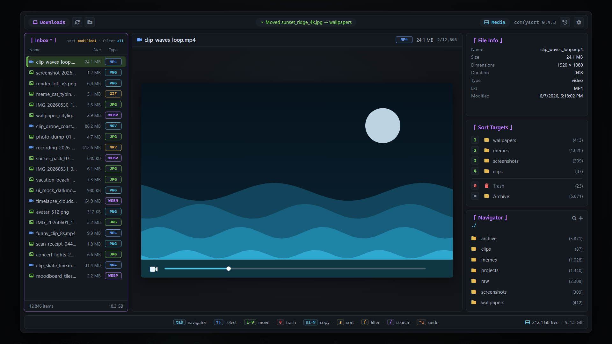
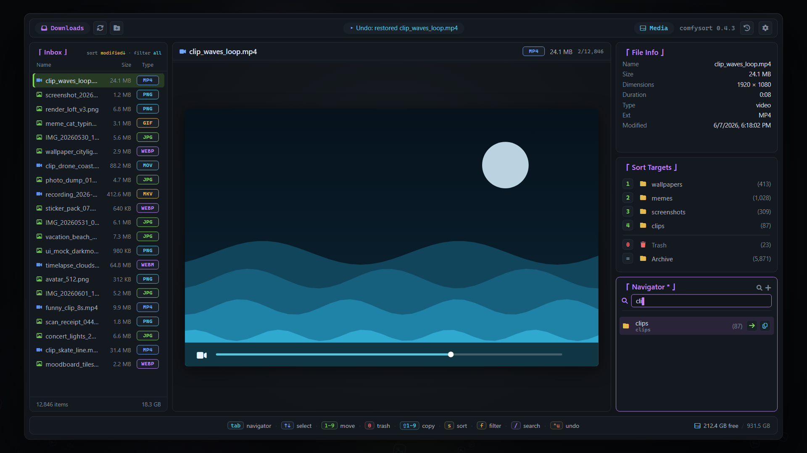
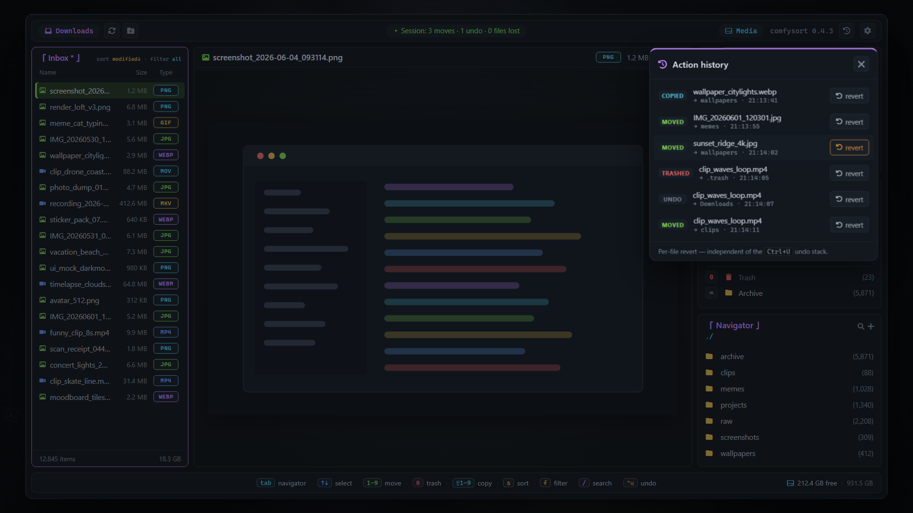
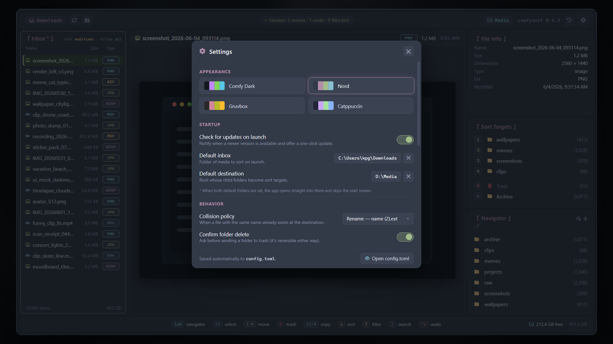
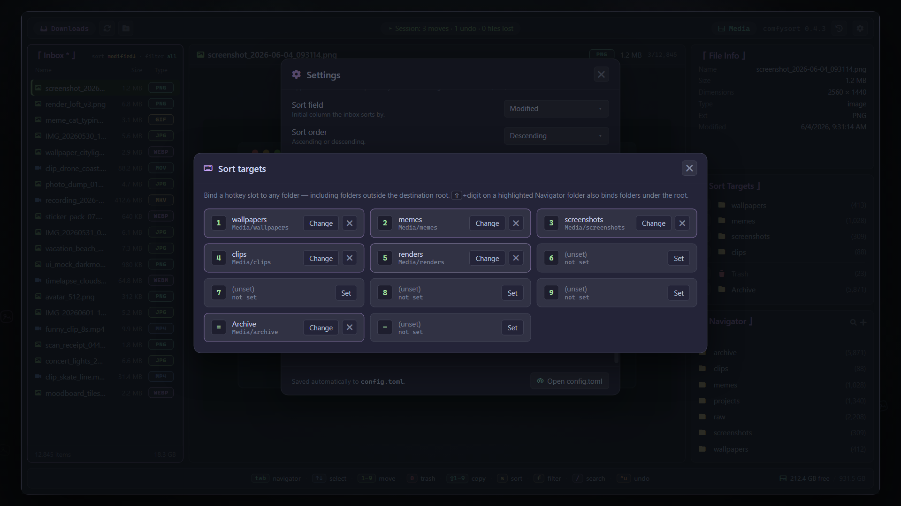

<div align="center">


<h1><samp>comfysort</samp></h1>

<p>
  <b>A calm, preview-first desktop workstation for sorting large piles of media — fast.</b><br>
  <i>Preview the file. Press a key. It moves. <kbd>Ctrl</kbd>+<kbd>U</kbd> walks it back. That's the whole loop.</i>
</p>

<p>
  
  
  
  
  
</p>

<p>
  <a href="https://github.com/kpg-anon/comfysort/releases/latest"></a>
</p>

</div>

https://github.com/user-attachments/assets/edd501ad-748d-4aa1-8101-778ac1b5e1d1

---

## ✨ Why

If you triage thousands of images and videos at a time — photo dumps, screenshot graveyards, render output — file managers slow you down because they want you to *navigate*. **comfysort wants you to decide.** The preview is the hero, every destination is a single keystroke, and every action is journaled and reversible.

Pick an **inbox** and a **destination root**, preview the current file, press <kbd>1</kbd>–<kbd>9</kbd> to move it (<kbd>0</kbd> trashes, <kbd>⇧</kbd>+digit copies), and it's gone — next file. It is **not** an auto-sorter: nothing on disk changes without an explicit action.

## 🎛️ Features

- **Triage fast** — native full-quality image & video previews; hotkey move/copy/trash; multiselect for batch ops; merge multiple inbox folders into one queue; virtualized for 25k+ files.
- **Organize** — folder **Navigator** with type-to-fuzzy-search, recursive media counts, and create/rename/delete; a **sort-target editor** that binds any folder (even outside the root) to any key.
- **Safe & reversible** — journaled operations, multi-step <kbd>Ctrl</kbd>+<kbd>U</kbd> undo, per-file revert from the **action history**, soft-delete trash, collision-safe renames, verified cross-drive moves.
- **Comfortable** — calm dark UI with 4 theme presets, settings persisted to `config.toml`, one-click in-app updater, portable no-install build.

## 🖥️ Screenshots

<div align="center">
  
  <br><sub>The three-column workstation — inbox queue · native preview · file info, hotkey sort targets & navigator</sub>
</div>

| | |
|:--:|:--:|
|  |  |
| <sub>Navigator — type to fuzzy-find any folder, <kbd>Enter</kbd> moves into it</sub> | <sub>Action history — every operation journaled, revert any single file</sub> |
|  |  |
| <sub>Settings — themes, collision policy, confirms, defaults (config.toml)</sub> | <sub>Sort-target editor — bind any folder to keys <kbd>1</kbd>–<kbd>9</kbd>, <kbd>=</kbd>, <kbd>−</kbd></sub> |

## ⬇️ Download

**[Latest release →](https://github.com/kpg-anon/comfysort/releases/latest)** (Windows x64)

| File | Notes |
|:--|:--|
| `comfysort_<version>_x64-setup.exe` | **Recommended** — installer with Start-menu entry, uninstaller, and seamless one-click in-app updates |
| `comfysort_<version>_x64-portable.zip` | No install — unzip and run `comfysort.exe`; updates are manual (the app links each new zip) |
| `comfysort_<version>_x64_en-US.msi` | MSI — managed / silent installs |

Needs the **WebView2 Runtime**, the Edge-based system component that ships with Windows 11 (and current Windows 10) — the installers download it automatically in the rare case it's missing. Everything else the app needs, including `WebView2Loader.dll`, is bundled inside every package. Builds are currently unsigned, so SmartScreen may warn on first launch — **More info → Run anyway**. Release notes mirror the [changelog](CHANGELOG.md).

## 🛠️ Build from source

Prereqs: Rust (stable), Node.js + npm, and the [Tauri v2 system prerequisites](https://v2.tauri.app/start/prerequisites/).

```bash
npm install
npm run tauri dev     # hot reload
npm run tauri build   # → target/release/comfysort.exe + installers
cargo test -p comfysort-engine   # engine tests (pure Rust, no webview)
```

## ⌨️ Keyboard essentials

<kbd>Tab</kbd> toggles focus between the **Inbox** and the **Navigator** (purple border + `*`). Hotkeys and undo are global; navigation routes by focus.

| Key | Action |
|:--|:--|
| <kbd>1</kbd>–<kbd>9</kbd> / <kbd>0</kbd> | Move current file (or selection) to that target / to trash |
| <kbd>Shift</kbd>+<kbd>1</kbd>–<kbd>9</kbd> | Copy instead of move *(in Navigator: bind highlighted folder to that slot)* |
| <kbd>Ctrl</kbd>+<kbd>U</kbd> | Undo the last operation — multi-step |
| <kbd>↑</kbd>/<kbd>↓</kbd> · <kbd>Shift</kbd>+<kbd>↑↓</kbd> | Select · extend multiselection |
| <kbd>s</kbd> / <kbd>f</kbd> / <kbd>Ctrl</kbd>+<kbd>R</kbd> | Cycle sort field / filter / sort order |
| <kbd>/</kbd> *(or just type in Navigator)* | Fuzzy-search every folder under the root |
| <kbd>Enter</kbd> / <kbd>Shift</kbd>+<kbd>D</kbd> | Move / copy into the highlighted Navigator folder |
| <kbd>→</kbd> <kbd>←</kbd> | Drill into / ascend folders |
| <kbd>Ctrl</kbd>+<kbd>N</kbd> · <kbd>F5</kbd> · <kbd>Esc</kbd> | New folder · rescan inbox · close / cancel |

Everything is also clickable — sort targets, navigator rows, and a right-click context menu on inbox items.

## 🛟 How it stays safe

- **No autonomous moves** — every mutation requires an explicit action.
- **Journal first** — append-only JSONL at `<output>/.comfysort/journal.jsonl`.
- **Soft delete only** — trash renames into `.comfysort/.trash/`, never an `rm`.
- **Collisions never clobber** — Explorer-style `name (2).ext` renames by default.
- **Cross-drive moves are verified** — copy → verify size → delete source, behind a confirm.
- **Undo is real** — a session stack walks every operation back; the action history reverts single files.

## 🧱 Under the hood

**Tauri v2 + SvelteKit (Svelte 5, SPA) + TypeScript** over a **pure-Rust engine**. The engine (`crates/engine`) has no Tauri imports and is fully testable on its own; all filesystem mutation lives in its operations layer. The Tauri shell (`src-tauri`) is the only IPC bridge, and the frontend mirrors the engine DTOs through one typed wrapper — mutating commands return small deltas so a 25k-file inbox never re-serializes.

Settings persist atomically to `config.toml` (theme, collision policy, confirms, defaults — set default folders and comfysort opens straight into them).

## 🗺️ Roadmap

Restart-safe undo via journal replay · worker queue for huge batches · breadcrumbs for the recursive inbox · self-updating portable build · richer media metadata (EXIF, codec) · backend thumbnail pipeline · macOS / Linux bundles.

## 📜 License

**[MIT](LICENSE)** — © 2026 kpg-anon.

---

<div align="center">
<sub>A calm place to sort your media. Preview the file. Press a key. <kbd>Ctrl</kbd>+<kbd>U</kbd> to undo.</sub>
</div>
